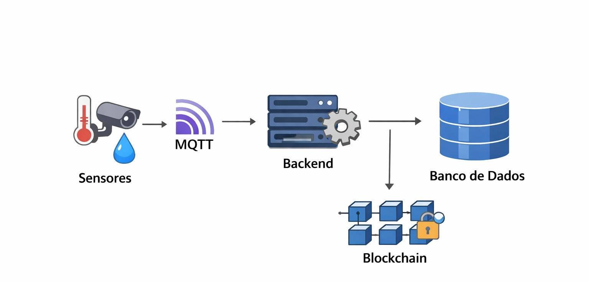

# Blockchain como Camada de Segurança em Redes IoT (MQTT + MongoDB + Ethereum)

[Português (Brasil)](README.md) | [English (US)](README.en-US.md)

Projeto experimental desenvolvido no contexto de TCC para avaliar o uso de blockchain como camada complementar de integridade e auditoria em uma arquitetura IoT corporativa.

## Objetivo

Comparar duas arquiteturas de processamento de dados IoT:

1. **Tradicional**: sensores -> MQTT -> backend -> MongoDB.
2. **Com blockchain**: sensores -> MQTT -> backend -> MongoDB + registro de evidências criptográficas em smart contract Ethereum.

Além da comparação de desempenho, o projeto também mede a capacidade de detectar adulteração pós-registro no banco de dados.

## Contribuição do Projeto

A proposta não substitui o banco tradicional por blockchain. Em vez disso, usa a blockchain para registrar **provas de integridade** (hash + metadados mínimos), mantendo os dados completos off-chain (MongoDB). Isso permite auditoria e rastreabilidade sem romper o fluxo convencional de sistemas IoT.

## Arquitetura Experimental



```text
Sensores simulados (Node.js/TS)
          |
          v
     MQTT (Mosquitto)
          |
          v
Backend (Node.js/TS) --> MongoDB (dados completos)
          |
          v
  SHA-256 + Smart Contract (Ethereum/Ganache)
```

### Componentes

- `apps/sensor-simulator`: simulação de 5 sensores (3 temperatura, 2 iluminação), publicação MQTT.
- `apps/backend`: consumo MQTT, validação, persistência, geração de hash e registro em ledger (`mock` ou `ethereum`).
- `contracts/integrity-registry`: smart contract em Solidity para registrar evidências de integridade.
- `packages/shared`: tipos e validação de payload de mensagem IoT.
- `infra/docker`: infraestrutura local com Mosquitto, MongoDB e Ganache.
- `scripts`: automação dos experimentos 3.7, 3.8 e relatório consolidado 3.9.
- `artifacts`: saídas dos experimentos e relatórios em Markdown/JSON.

## Stack

- Node.js + TypeScript
- MQTT (broker Mosquitto)
- MongoDB
- Ethereum local (Ganache)
- Solidity + Hardhat + ethers
- Docker Compose

## Estrutura de Mensagem IoT

Payload JSON validado pelo pacote compartilhado:

```json
{
  "sensorId": "temp-01",
  "buildingId": "building-A",
  "type": "temperature",
  "value": 22.4,
  "timestamp": "2026-03-12T20:00:00Z"
}
```

## Como Executar (Passo a Passo)

### 1) Pré-requisitos

- Node.js 20+
- npm 10+
- Docker + Docker Compose

### 2) Instalar dependências

```bash
npm run install:all
```

### 3) Subir infraestrutura local

```bash
docker compose -f infra/docker/docker-compose.yml up -d
```

Serviços expostos:

- Mosquitto: `localhost:1883`
- MongoDB: `localhost:27017`
- Ganache: `localhost:8545`

### 4) Executar aplicação manualmente

Terminal A (backend):

```bash
npm run dev:backend
```

Terminal B (sensores):

```bash
npm run dev:sensors
```

## Modos do Backend

### Modo tradicional (sem blockchain real)

Padrão: `LEDGER_MODE=mock`

```bash
LEDGER_MODE=mock npm run dev:backend
```

### Modo blockchain (Ethereum)

1. Faça deploy local do contrato:

```bash
npm run deploy:contracts:local
```

2. Configure variáveis de ambiente (exemplo):

```bash
LEDGER_MODE=ethereum
ETH_RPC_URL=http://localhost:8545
ETH_PRIVATE_KEY=<chave-privada-ganache>
INTEGRITY_REGISTRY_ADDRESS=<endereco-do-contrato>
```

3. Inicie o backend.

Observação: já existe um `.env` no projeto com exemplo de configuração local.

## Execução dos Experimentos do TCC

### Experimento 3.7 (Tradicional vs Blockchain)

```bash
npm run experiment:3.7
```

Artefatos padrão:

- `artifacts/experiment-3.7/scenario-traditional.json`
- `artifacts/experiment-3.7/scenario-blockchain.json`
- `artifacts/experiment-3.7/comparison.md`

Smoke test:

```bash
npm run experiment:3.7 -- --runs=1 --durationSec=10 --warmupSec=2 --outDir=/tmp/experiment-3.7-smoke
```

### Experimento 3.8 (Adulteração de Dados)

```bash
npm run experiment:3.8
```

Artefatos padrão:

- `artifacts/experiment-3.8/scenario-adulteration.json`
- `artifacts/experiment-3.8/tamper-report.md`

Smoke test:

```bash
npm run experiment:3.8 -- --runs=1 --durationSec=20 --warmupSec=5 --tamperRate=0.2 --outDir=/tmp/experiment-3.8-smoke
```

### Experimento 3.9 (Relatório Consolidado)

```bash
npm run report:3.9
```

Saída:

- `artifacts/experiment-3.9/evaluation-report.md`

## Métricas Avaliadas

### Desempenho (Experimento 3.7)

- `messagesProcessed`
- `throughputMps`
- `latencyAvgMs`
- `latencyP95Ms`
- `failureRate`

Fórmula de variação usada no comparativo:

```text
variacao% = ((blockchain - tradicional) / tradicional) * 100
```

### Integridade/Auditoria (Experimento 3.8)

- `eligibleRecords`
- `tamperedRecords`
- `detected`
- `undetected`
- `verificationErrors`
- `detectionRate`

## Resultados Consolidados (execução de referência)

Com base nos artefatos já versionados (`artifacts/experiment-3.7-10-run`, `artifacts/experiment-3.8-10-run`, `artifacts/experiment-3.9`):

- O cenário com blockchain apresentou aumento relevante de latência média e p95.
- O throughput sofreu queda moderada no cenário blockchain.
- A taxa de detecção de adulteração registrada foi **100%** (sem falsos negativos no conjunto analisado).

Interpretação: há trade-off entre desempenho e garantias de integridade/rastreabilidade.

## Testes

```bash
npm run test:backend
npm run test:contracts
```

## Documentação Complementar

- `docs/sensor-simulator.md`
- `docs/backend-processing.md`
- `docs/smart-contract-integrity-registry.md`
- `text-meta-data/metodology.md`

## Licença

Este projeto está sob licença MIT. Consulte `LICENSE`.
